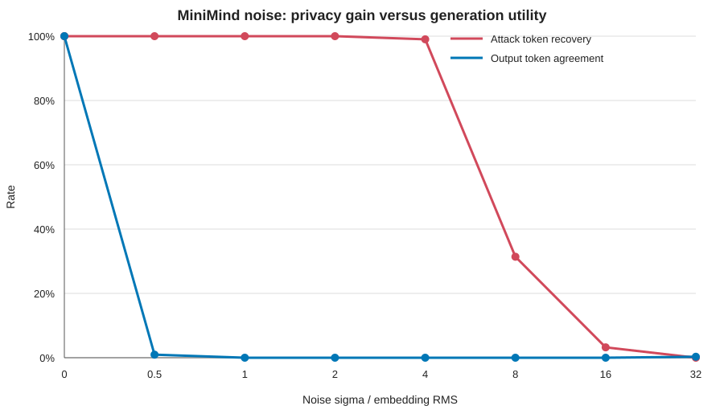

# Q1 Hidden State 反演 PoC

## 1 目的

题目方案把模型的 Embedding 和 Unembedding 留在企业侧，只把 hidden state 发送到云端，并据此认为云端看不到 prompt 和生成 token。

本 PoC 验证其中最基本的安全问题：

> 当企业上传的是 Embedding 输出时，云端能否从 hidden state 恢复原始输入？

实验使用 MiniMind-3 的真实 tokenizer 和真实 embedding 权重，不使用随机生成的词表或向量。

## 2 被模拟的推理流程

```text
原始文本
   ↓ tokenizer
token IDs
   ↓ 企业侧 Embedding
hidden state ───────────────→ 云端
                               ↓ Transformer 中间层
企业侧 Unembedding ←──────── hidden state
   ↓
生成 token
```

PoC 截获箭头处的 hidden state，并站在云服务商的视角尝试恢复输入。

## 3 威胁模型

攻击者是“诚实但好奇”的云服务商：它仍按协议执行推理，但会保存和分析收到的 hidden state。

假设攻击者：

- 能读取企业上传的 hidden state；
- 知道使用的是哪个开源模型；
- 能获得模型 tokenizer 和 embedding 矩阵；
- 不知道原始 prompt；
- 不能访问企业内部系统和本地密钥。

即使通信使用 TLS，该攻击仍然成立，因为 TLS 只防止链路上的第三方窃听，接收 hidden state 的云端本身可以看到解密后的数据。

## 4 为什么可以反演

设词表大小为 `V`，hidden size 为 `d`，模型的 embedding 矩阵为：

```text
E ∈ R^(V × d)
```

输入位置 `i` 的 token ID 为 `t_i`，Embedding 输出就是矩阵的对应行：

```text
h_i = E[t_i]
```

云端拿到 `h_i` 后，可以将它与 `E` 的全部行计算余弦相似度：

```text
t_hat_i = argmax_j cosine(h_i, E[j])
```

没有扰动时，`h_i` 本来就是 `E` 中的一行。因此，这不是根据语义猜测文本，而是对 embedding 表做反向查表。

攻击复杂度为：

```text
O(sequence_length × vocab_size × hidden_size)
```

实现中把它转换为一次矩阵乘法，因而即使遍历整个词表也很快。

## 5 实验方法

### 5.1 加载真实模型资产

首次运行时，`run.ps1` 下载约 122 MiB 的 MiniMind-3 `model.safetensors`。Python 脚本直接解析 safetensors 文件中的：

```text
model.embed_tokens.weight
```

该矩阵形状为 `6400 × 768`，即词表大小 6400、hidden size 768。脚本直接读取所需张量，因此不需要 PyTorch 或 Transformers，只需要 NumPy。

### 5.2 构造输入 token

脚本读取 MiniMind tokenizer 的 ByteLevel 字节映射，将 UTF-8 文本转换为可逆的基础 token。这里不执行 BPE merge，但生成的仍是合法 token 序列，并能无损解码回原文。

使用基础 token 的原因是让 PoC 只依赖标准库和 NumPy。它不会削弱攻击结论：无论 token 是基础 token 还是 BPE 合并 token，只要上传值为对应 embedding 行，相同的最近邻攻击都成立。

默认测试 5 条包含项目、身份、财务、服务器和访问密钥信息的中英文 prompt，共 309 个 token。

### 5.3 模拟传输

企业侧根据 token ID 从 embedding 矩阵取出对应行：

```python
transmitted_hidden = embedding[token_ids]
```

`transmitted_hidden` 就是攻击者在 Embedding 切分点能够观察到的张量。

### 5.4 最近邻恢复

脚本将 hidden state 和 embedding 表逐行归一化，然后执行：

```python
scores = normalize(hidden) @ normalize(embedding).T
recovered_ids = scores.argmax(axis=-1)
```

最后用 tokenizer 的可逆字节映射把 token ID 解码回文本。

## 6 评价指标

### Token 恢复率

```text
恢复正确的 token 数量 / token 总数
```

### 完整序列恢复

只有所有位置的 token 都正确，才记为完整恢复。

### Clean Noisy Cosine

加噪实验中，计算干净向量与加噪向量的平均余弦相似度。它只用于衡量表示失真程度：

- 越接近 1，表示越接近原始 hidden state；
- 越接近 0，表示中的原始方向信息越少。

它不是下游生成质量或任务准确率，完整效用评估仍需把加噪 hidden state 送入模型后续层。

## 7 基线攻击结果

| 模型 | Prompt 数量 | Token 数量 | Token 恢复率 | 完整序列恢复 |
|---|---:|---:|---:|---:|
| MiniMind-3 | 5 | 309 | 100% | 是 |

5 条原始 prompt 都被逐字节完整恢复。这证明：**只把 Embedding 留在企业侧，不能隐藏输入。**

自回归 decode 也有相同问题。企业生成一个 token 后，下一轮需要把它的 embedding 再发给云端，所以云端可以用相同方法逐步恢复生成内容。

## 8 缓解实验一 高斯噪声

脚本在上传前加入不同强度的零均值高斯噪声：

```text
h_noisy = h + N(0, σ²)
```

`σ` 使用 embedding 每维 RMS 的倍数表示。

| 噪声强度 | Token 恢复率 | Clean Noisy Cosine |
|---:|---:|---:|
| 0 | 100.00% | 1.0000 |
| 0.5 | 100.00% | 0.8828 |
| 1 | 100.00% | 0.6851 |
| 2 | 100.00% | 0.4264 |
| 4 | 99.03% | 0.2253 |
| 8 | 31.39% | 0.1159 |
| 16 | 3.24% | 0.0568 |
| 32 | 0.00% | 0.0272 |

结果说明，少量噪声不足以阻止简单最近邻攻击；恢复率明显下降时，hidden state 与原表示的相似度也已经很低。因此加噪体现的是隐私与效用折中，不应被描述为强安全保证。

## 9 安全—效用实测

余弦相似度不能代表生成质量，因此 PoC 进一步把噪声注入真实分割推理：对 10 个固定中英文 prompt，在每次 prefill 和 decode 的 embedding 上云前加入独立高斯噪声，并将生成 token 与无噪声输出逐位置比较。

```powershell
powershell -ExecutionPolicy Bypass -File .\q1-poc\run-tradeoff.ps1
```



| 噪声 σ/RMS | 攻击 Token 恢复率 | 输出 Token 一致率 | 首 Token 一致率 | 完整序列一致率 |
|---:|---:|---:|---:|---:|
| 0 | 100.00% | 100.00% | 100% | 100% |
| 0.5 | 100.00% | 0.94% | 0% | 0% |
| 1 | 100.00% | 0.00% | 0% | 0% |
| 2 | 100.00% | 0.00% | 0% | 0% |
| 4 | 99.03% | 0.00% | 0% | 0% |
| 8 | 31.39% | 0.00% | 0% | 0% |
| 16 | 3.24% | 0.00% | 0% | 0% |
| 32 | 0.00% | 0.31% | 0% | 0% |

结果表明不存在有用的安全—效用甜点区：轻噪声尚不能降低最近邻攻击恢复率，却已经使生成结果与干净基线完全分叉；噪声强到足以显著降低攻击恢复率时，输出早已不可用。σ=32 的 0.31% 是随机 token 偶然相同，不表示效用回升。

因此，直接对每次传输的 embedding 添加普通高斯噪声不适合作为当前方案的有效缓解措施，也不能提供差分隐私或密码学保证。机器可读结果和逐 prompt 输出位于 `results/noise-utility-tradeoff.json`。

## 10 缓解实验二 两方加法秘密共享

脚本先把 hidden state 定点量化到有限域，然后生成两份加法 share：

```text
share_A ← random
share_B = hidden - share_A mod p
hidden = share_A + share_B mod p
```

单个 share 是均匀随机数据，与原 hidden state 统计独立。实验结果为：

| 攻击者看到的数据 | Token 恢复率 |
|---|---:|
| 仅 `share_A` | 0% |
| 合并 `share_A + share_B` | 100% |

这说明秘密共享可以提供比“隐藏向量含义”更明确的安全性质，但它不能直接替换当前方案：单个云端只有一份 share，无法运行普通 Transformer。矩阵乘法、Softmax、激活函数和采样都必须改造成 MPC 协议，这会引入显著通信和计算成本。

## 11 PoC 能证明什么

本 PoC 能证明：

- MiniMind-3 的 Embedding 输出可被简单、快速地恢复；
- hidden state 不是天然的密文；
- TLS 不能阻止云服务商执行该攻击；
- 轻量加噪未必有效，强加噪会严重破坏表示；
- 秘密共享可隐藏单方观察值，但要求改造云端计算协议。

本 PoC 不能单独证明：

- 所有更深 Transformer 层都能达到 100% 恢复率；
- Clean Noisy Cosine 等同于模型准确率；
- TEE、HE 或完整 MPC 系统的端到端性能；
- 面对未知 embedding 权重时攻击仍具有相同成功率。

评估更深层切分点时，需要分别截取每层 hidden state，并训练 inversion decoder、token classifier 或使用优化式攻击，同时测量生成质量和任务准确率。

## 12 一条命令复现

从 `interview-challenge` 目录执行：

```powershell
powershell -ExecutionPolicy Bypass -File .\q1-poc\run.ps1
```

首次运行自动下载 MiniMind-3 权重。测试自定义 prompt：

```powershell
powershell -ExecutionPolicy Bypass -File .\q1-poc\run.ps1 `
  --prompt "合同总价为五百万元，仅限董事会阅览。"
```

多次传入 `--prompt` 可以测试多个输入：

```powershell
powershell -ExecutionPolicy Bypass -File .\q1-poc\run.ps1 `
  --prompt "第一条机密信息" `
  --prompt "第二条机密信息"
```

机器可读结果保存在：

```text
q1-poc/results/results.json
```

## 13 文件说明

```text
q1-poc/
├── q1_hidden_state_attack.py   # 攻击、指标和缓解实验
├── run.ps1                     # 一键运行和模型下载
├── requirements.txt            # NumPy 依赖
├── assets/                     # 下载的模型权重，不提交 Git
└── results/                    # 实验结果，不提交 Git
```

## 14 Qwen3-1.7B 补充验证

以上 MiniMind 实验是 Q1 的主 PoC。为避免安全—可用性结论只依赖能力较弱的小模型，项目最后使用本地 Qwen3-1.7B BF16 权重补充验证相同趋势。

实验在每次传输的 Embedding 上加入独立高斯噪声；攻击者已知完整 Embedding 表，并使用余弦最近邻恢复 Token。可用性以噪声输出相对无噪声输出的 Token 一致率衡量。

| 噪声 σ / Embedding RMS | 攻击 Token 恢复率 | 输出 Token 一致率 | 完全一致回答率 |
|---:|---:|---:|---:|
| 0 | 100.0% | 100.0% | 100.0% |
| 0.5 | 100.0% | 91.7% | 66.7% |
| 1 | 100.0% | 33.3% | 0.0% |
| 2 | 97.8% | 16.7% | 0.0% |
| 4 | 80.4% | 8.3% | 0.0% |
| 8 | 65.2% | 25.0% | 0.0% |
| 16 | 4.3% | 16.7% | 0.0% |
| 32 | 0.0% | 16.7% | 0.0% |

结论：在攻击恢复率仍为 100% 的 1 倍噪声处，输出一致率已经下降到 33.3%；要将攻击恢复率压至接近 0，需要 16～32 倍噪声，此时回答早已不可用。因此，Qwen3-1.7B 实验同样支持：**朴素加噪不能同时保证隐变量保密性与生成可用性。**

高噪声区的一致率不严格单调，是因为本地实验仅使用 3 个提示、每题生成 4 个 Token，错误 Token 偶然相同会引起波动；从 1 倍噪声开始，完全一致回答率始终为 0。完整原始数据、曲线和复现脚本位于 [`../qwen3-validation`](../qwen3-validation/README.md)。
