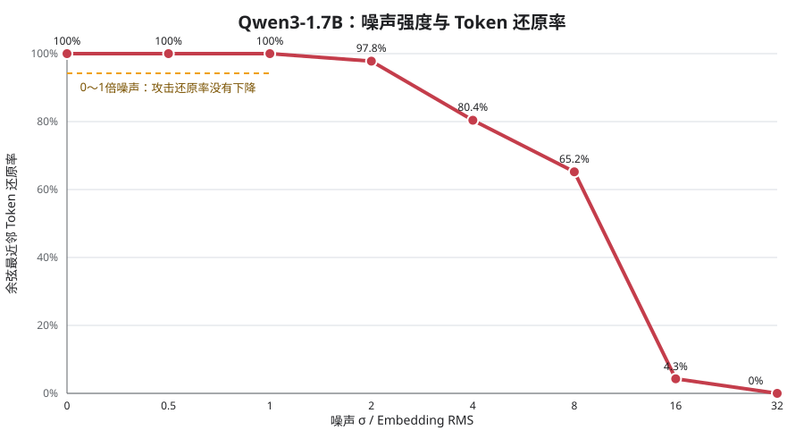

# Q2：MiniMind基础分割推理

## 1. 交付结论

本PoC以MiniMind-3为主模型，实现了可以独立启动的企业侧与云侧分割推理服务，并完成进程内、HTTP端到端和GSM8K三层验证。

```text
企业侧：Tokenizer → Embedding
                     ↓ FP32 hidden state
云侧：             8层Transformer + 每请求KV Cache
                     ↓ FP32 hidden state
企业侧：Final RMSNorm → tied LM Head → Greedy Decode → 输出
```

核心结果：

- 单体MiniMind与分割MiniMind逐Token完全一致；
- 5个固定问题的HTTP端到端Token序列和文本一致率均为100%；
- GSM8K前50题中，两条路径均答对1题，且是同一道题；
- 因此2%的准确率来自MiniMind本身能力，而不是模型分割引入的损失；
- 后置Qwen3-1.7B补充实验进一步得到27/50，证明分割方案可用于能力更强的模型。

## 2. 分割方案与实现

### 2.1 企业侧

企业侧保留：

- Tokenizer；
- Embedding；
- Final RMSNorm；
- LM Head与Greedy采样；
- 对外生成接口。

企业侧将Prompt转换成Embedding，只向云端发送Hidden State、请求ID和缓存控制信息。云端接口不接收明文Prompt或Token ID。

### 2.2 云侧

云侧执行：

- 8个MiniMind Transformer Block；
- Prefill；
- 逐Token Decode；
- 每请求独立KV Cache；
- 请求结束后的Cache释放。

### 2.3 Prefill与Decode

- **Prefill：**企业侧一次发送整个Prompt的Embedding，云端8层生成各层KV Cache；
- **Decode：**企业侧每轮只发送最新Token的Embedding，云端读取并扩展KV Cache，只返回最新位置的Hidden State；
- **释放：**生成结束后调用`/release`删除对应请求的KV Cache。

当前Q2只实现题目要求的基础分割推理，不在服务中默认加入噪声、TEE或加密。安全方案的影响通过独立消融实验评估。

## 3. 一键启动与问答

从`interview-challenge`目录执行。

仅启动企业侧和云侧服务：

```powershell
powershell -ExecutionPolicy Bypass -File .\q2-split-inference\run.ps1
```

直接问答：

```powershell
$body = @{prompt="中国的首都是哪里？"; max_new_tokens=16; stream=$false} | ConvertTo-Json
Invoke-RestMethod `
  -Uri http://127.0.0.1:8100/generate `
  -Method Post `
  -ContentType "application/json; charset=utf-8" `
  -Body ([Text.Encoding]::UTF8.GetBytes($body))
```

停止服务：

```powershell
powershell -ExecutionPolicy Bypass -File .\q2-split-inference\stop.ps1
```

首次启动会创建Python 3.11虚拟环境、安装CPU版PyTorch并准备MiniMind-3权重；后续运行复用现有环境和本目录`assets/`中的权重。

## 4. MiniMind正确性验证

### 4.1 一键完整验证

```powershell
powershell -ExecutionPolicy Bypass -File .\q2-split-inference\verify-all.ps1
```

验证包括：

1. 进程内单体模型与分割模型对齐；
2. 完整HTTP路径对齐：`客户端 → 企业侧HTTP → Base64 Hidden State → 云侧HTTP → 企业侧LM Head`。

HTTP测试使用5个固定中英文问题，在相同权重和Greedy Decode下逐Token比较：

| 指标 | 结果 |
|---|---:|
| 问题数 | 5 |
| Token序列一致率 | 100% |
| 文本一致率 | 100% |

结果位于`results/correctness.json`和`results/http-e2e-correctness.json`。这是真实MiniMind Transformer推理，不是随机Tensor或`sleep`模拟。

### 4.2 接口

| 服务 | 接口 | 作用 |
|---|---|---|
| 企业端`8100` | `GET /health` | 健康检查 |
| 企业端`8100` | `POST /generate` | 文本生成，支持SSE |
| 企业端`8100` | `POST /v1/chat/completions` | 简化OpenAI风格入口 |
| 云端`8101` | `GET /health` | 健康检查 |
| 云端`8101` | `POST /forward` | Prefill或单步Decode |
| 云端`8101` | `POST /release` | 删除请求KV Cache |

## 5. MiniMind GSM8K主实验

运行OpenAI官方GSM8K Test Split固定前50题：

```powershell
powershell -ExecutionPolicy Bypass -File .\q2-split-inference\gsm8k.ps1
```

也可以指定题数、偏移和最大生成长度：

```powershell
.\q2-split-inference\gsm8k.ps1 -Samples 100 -Offset 0 -MaxNewTokens 64
```

脚本校验数据集SHA-256，并使用相同权重、Prompt和Greedy Decode分别执行单体与分割模型。

| 指标 | 单体MiniMind | 分割MiniMind |
|---|---:|---:|
| 题目数 | 50 | 50 |
| 答对题数 | 1 | 1 |
| GSM8K Exact Match | 2% | 2% |
| Token序列一致率 | — | 100% |
| 文本一致率 | — | 100% |
| 准确率差 | — | 0个百分点 |

两条路径答对的是同一道题：子集索引`31`（第32题）。该题标准答案为`80`，两条路径提取结果均为`80`，生成文本和Token序列完全一致。其余49题的Token同样完全一致，但答案均未命中。

因此：

> MiniMind的2%准确率反映其约63.9M参数和有限数学推理能力；这50题中没有观察到分割造成的精度损失。

逐题结果位于`results/gsm8k-comparison.json`。这只是固定50题PoC子集，不是完整1319题GSM8K成绩。

## 6. Qwen3-1.7B补充对照

MiniMind是本PoC的主实现。由于其GSM8K能力过低，补充使用Qwen3-1.7B验证分割路径在更强模型上的正确性和任务可用性。

### 6.1 短序列逐Token对齐

Qwen3分割路径为：

```text
企业侧Embedding
  → 云侧28层Transformer与逐请求KV Cache
  → 企业侧RMSNorm / LM Head / Greedy Decode
```

3个中英文问题、每题生成4个Token时，逻辑未分割路径与分割路径3/3完全一致，平均Token一致率100%。该实验真实执行本地Qwen3-1.7B BF16权重；短输出用于控制16 GB内存CPU机器的实验时长。

### 6.2 GSM8K效果对比

| 模型与路径 | 精度/后端 | 题目数 | 答对 | 准确率 |
|---|---|---:|---:|---:|
| MiniMind单体 | FP32 / PyTorch | 50 | 1 | 2% |
| MiniMind分割 | FP32 / PyTorch | 50 | 1 | 2% |
| Qwen3-1.7B原始 | Q4 / llama.cpp | 50 | 28 | 56% |
| **Qwen3-1.7B分割** | **BF16 / PyTorch** | **50** | **27** | **54%** |

Qwen3分割模型比MiniMind分割模型高52个百分点，使GSM8K成为有区分度的可用性实验。Qwen原始与分割结果只差1题，但两者的精度格式和执行后端不同，不能把2个百分点直接解释为分割损失；分割数学等价性应以前述同BF16权重的逐Token对齐结果为证据。

配置：GSM8K前50题、Greedy Decode、`/no_think`、最多128个输出Token。逐题结果位于`../qwen3-validation/results/qwen3-1.7b-gsm8k-split-noise.json`。

## 7. Qwen3噪声、还原率与任务可用性

在每次传输的Prefill/Decode Embedding上加入独立高斯噪声。攻击者已知Embedding表，并用余弦最近邻恢复Token。



| 噪声σ / Embedding RMS | Token还原率 | 输出Token一致率 |
|---:|---:|---:|
| 0 | 100.0% | 100.0% |
| 0.5 | 100.0% | 91.7% |
| 1 | 100.0% | 33.3% |
| 2 | 97.8% | 16.7% |
| 4 | 80.4% | 8.3% |
| 8 | 65.2% | 25.0% |
| 16 | 4.3% | 16.7% |
| 32 | 0.0% | 16.7% |

图中最关键的区间是0～1倍噪声：攻击还原率始终为100%，但输出Token一致率已经从100%下降到33.3%。要把还原率压到接近0，需要16～32倍噪声，此时输出早已不可用。

GSM8K前10题进一步验证了任务层面的影响：

| 噪声σ / Embedding RMS | 答对 | GSM8K准确率 | Token还原率 |
|---:|---:|---:|---:|
| 0 | 4/10 | 40% | 100% |
| 0.5 | 3/10 | 30% | 100% |
| 1 | 0/10 | 0% | 100% |

结论：**0.5～1倍噪声没有带来可观察的隐私收益，却已将GSM8K准确率从40%降低到30%和0%。** 朴素独立高斯噪声首先破坏语义，随后才降低攻击恢复率，不适合作为当前分割方案的可用安全增强。

噪声GSM8K使用同一前10题进行受控消融；1倍噪声已全部失败，无需将该档扩大到50题才能作出工程不可用判断。逐题结果位于`../qwen3-validation/results/qwen3-1.7b-gsm8k-noise-subset.json`。

Qwen3一键复现：

```powershell
powershell -ExecutionPolicy Bypass -File .\qwen3-validation\run-gsm8k.ps1
```

## 8. 当前范围与证据边界

- MiniMind主实现：8层、Hidden Size 768、词表6400、CPU、Greedy Decode、本机HTTP、JSON/Base64 FP32 Activation、Batch Size 1；
- Qwen3补充实现：1.7B、28层、BF16、CPU；
- Q2证明基础分割能够真实运行，并在相同权重和Decode条件下保持输出一致；
- GSM8K对比证明MiniMind低准确率来自模型能力，Qwen3分割模型具备明显更高任务可用性；
- 噪声实验表明朴素加噪无法兼顾反演防护和输出质量；
- 并发、流水线和调度优化见相邻的`q3-scheduler-poc`目录；
- 本地CPU结果不代表目标GPU环境的绝对性能。
